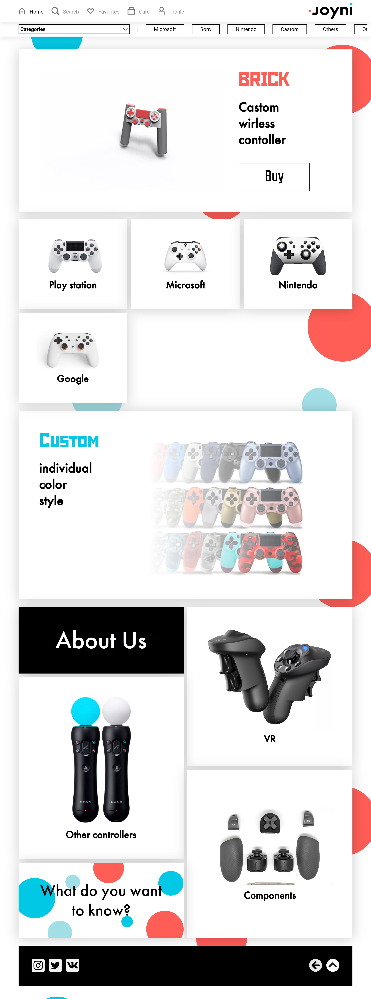
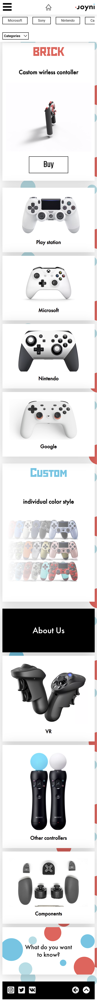

A multi-page online store website adapted from the tablet version for all resolutions.

Contains the implementation of using the JustValidate plugin. 

Designer... The designer experimented in the process of creating the layout, so I had to finish it for him.

View Desktop version screenshot of the first page

  

View Mobile version screenshot of the first page

  

 
 

You can see this [this on GitHub Pages].

[Layout on the Figma](https://www.figma.com/community/file/988746071506641304)

[this on GitHub Pages]: https://ulyanov-programmer.github.io/gameStore/gameStore/
